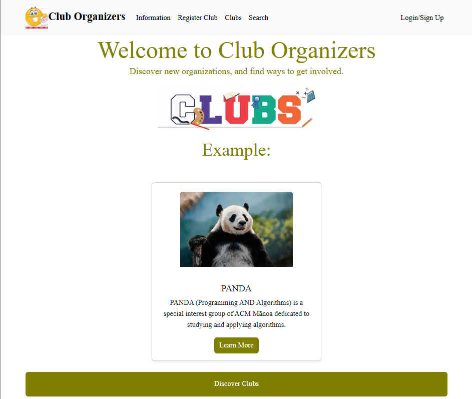
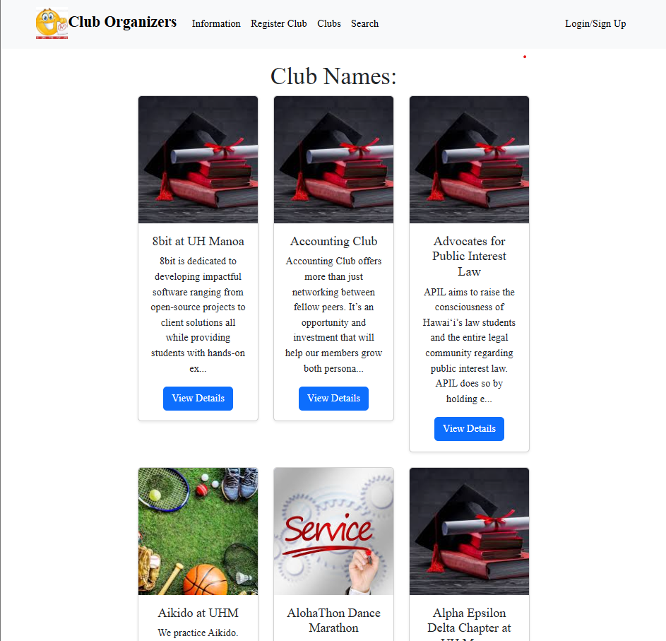
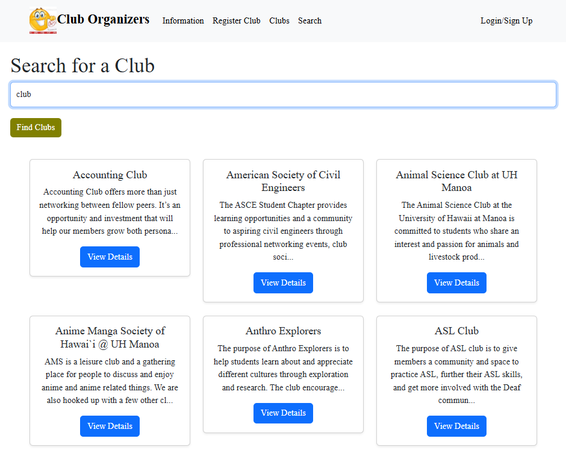
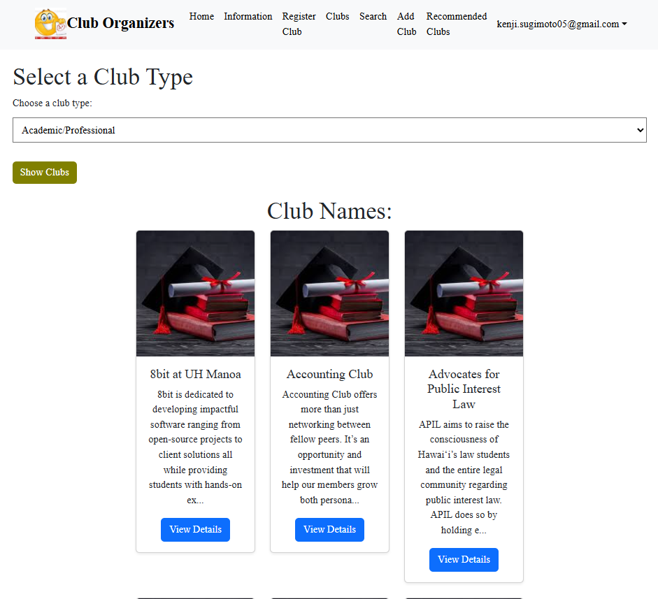

## Club Organizers

Club Organizers is a website that I helped work on with four other students to create a website that aids clubs in finding new members. It's a website that allows club owners to create cards that describe their club so that it's easier for students who might be interested to find them. Due to the sheer number of clubs on campus, it gets hard for smaller clubs to gain members and keep their clubs alive. Club Organizers was created to assist all clubs by providing an equal opportunity to advertise clubs through our website.

## My Contributions

My contributions to this project focused on frontend changes, including:

  - Creating the landing page for the website
  - Creating a page where users can see all clubs
  - Creating a page where users can search for clubs
  - Creating a page where logged-in users can search for clubs by type

Some of my other contributions included:

  - Creating a way for administrators to delete club postings
  - Accessing Supabase to separate and display clubs as cards
  - Created the view details button on all club cards
    - Also separated the full club descriptions, type, contact info, and email into their own websites, accessed through this button

## What I Learned

This project taught me much more about working with a group on coding projects. Before doing this project, I had no experience working in a group and no idea how to manage separating work and setting guidelines. This project taught me about Agile Project Management and the importance of coding standards and communication. It was a valuable experience that gave me a look into what software engineering is all about. 

## Images

  

  

  

  

## Links

  - [Organization](https://github.com/club-organizers)
  - [Mockup Page](https://sites.google.com/hawaii.edu/cluborganizers/landing-page)
  - [Project Boards](https://github.com/orgs/club-organizers/projects)
  - [Website](https://club-main-sandy.vercel.app/LandPage)
  
